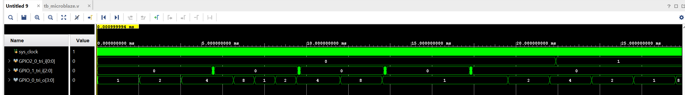

# Homework 10 — Zynq PS and MicroBlaze

Implementation of the same running LED application using:

- Zynq Processing System
- MicroBlaze soft processor

Development tools:

- Vivado 2022.2
- Vitis 2022.2
- XSim
- ZedBoard / XC7Z020

---

## Functionality

The application implements a running LED pattern:

```text
LED0 -> LED1 -> LED2 -> LED3 -> ...
```

Controls:

- `BTNC` — faster
- `BTND` — slower
- `BTNL` — stop / resume
- `SW0` — change direction

LED timing is controlled by an AXI Timer interrupt, without software busy-loop delays.

---

# Task 1 — Zynq PS

The Zynq implementation uses:

- Zynq Processing System
- AXI GPIO
- AXI Timer
- AXI interrupt connection
- ARM Cortex-A9 software application

The design was successfully tested on a real ZedBoard.

## Hardware Demo


Original video:

[Open hardware video](hardware/zynq_running_led.MOV)

Main software source:

```text
task1_zynq/Homework_10_Zynq/running_led_zynq/src/main.c
```

---

# Task 2 — MicroBlaze

The MicroBlaze implementation uses:

- MicroBlaze
- Local BRAM
- AXI GPIO
- AXI Timer
- AXI Interrupt Controller
- XSim testbench

The application ELF generated in Vitis is used during simulation.

The testbench checks:

- running LED sequence
- speed increase
- speed decrease
- stop / resume
- direction change

## Simulation Result



Main software source:

```text
task2_microblaze/Homework_10_MicroBlaze/vitis_workspace_mb/running_led_microblaze/src/main.c
```

Testbench:

```text
task2_microblaze/Homework_10_MicroBlaze/Homework_10_MicroBlaze.srcs/sim_1/new/tb_microblaze.v
```

---

## Project Structure

```text
Homework_10_Zynq_MicroBlaze/
├── task1_zynq/
├── task2_microblaze/
├── hardware/
│   ├── zynq_running_led.MOV
│   └── zynq_running_led.gif
├── screenshots/
│   └── microblaze_waveform.png
├── .gitignore
└── README.md
```

---

## Result

- Zynq PS version tested successfully on real hardware.
- MicroBlaze version tested successfully in XSim.
- AXI Timer controls LED timing in both implementations.
- Button and switch controls work as required.